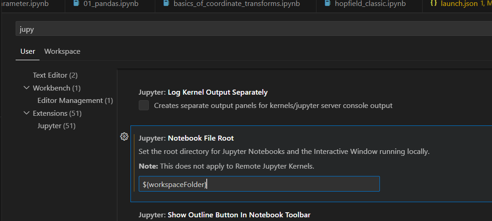

what this REPO is:  
a sorted collection of templates which show different data processing methods. 

data_processing: 
    Many methods examined in this folder are taken from a book "Data-Driven Science and Engineering: Machine Learning, Dynamical Systems, and Control"  by Brunton and Kutz. 
    Morhpology, graphs and image processing scipts are snippets of code from my past experience. 

multiprocessing:
    Few templates for CPU/GPU parallization.  
    CPU stuff uses multiprocessing library where async pool workers is created and shared memory region is used. 
    GPU stuff is yoinked from pytorch. Functional methods are disconnected from neural network environment and can be used for image processing or linear algebra operations. 

neural_networks: 
    Here i have working examples of simple neural networks 
    XNN_from_scratch- is an exercise of writing Deep NN and Convolutional NN only using numpy. 
    Hopfield_Networks- is an interesting approach of storing and restoring incomplete information by making original info (memories) into one-to-all connected dense network. 
    autoencoder- network for compression of restoration of data. It can modified for de-noising or retrieval of missing data. Variational autoencoder is a modification which changes how to view compressed state (latent space)- uit is viewed as probability distribution, from which by sampling, new data can be created. 
    GAN - somewhat similar to autoencoder (specially variational type). Except network has a critic, which learns if generated data looks authentic. 

plots/misc_tools: 
    random methods that cannot be classified as standalone type. 

in vscode jupyter sets its working dir to file dir, so you cannot import modules from workspace. Change this:

    
For future:
    -logging: https://www.youtube.com/watch?v=9L77QExPmI0
    -entropy: https://towardsdatascience.com/but-what-is-entropy-ae9b2e7c2137
